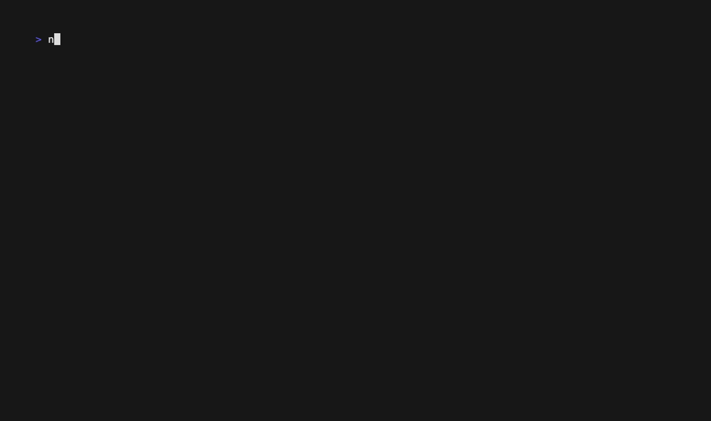
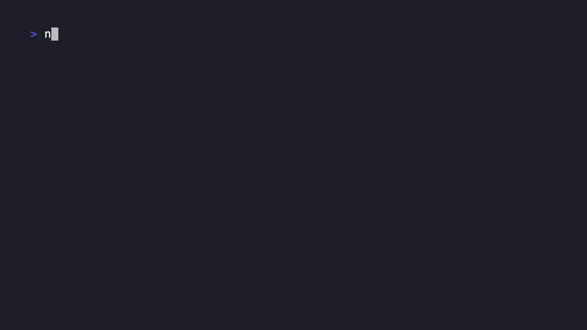

[ENGLISH](README.md) | [한국어](README.ko.md)

# Scanrail

[](https://github.com/raeseoklee/scanrail/actions/workflows/ci.yml)
[](https://www.npmjs.com/package/scanrail)
[](LICENSE)

Scanrail is a developer-first security scan orchestrator. It wraps proven open-source security tools behind one CLI so teams can run repeatable security checks before a pull request, release, or internal handoff.

Scanrail does not try to reimplement a commercial SAST or DAST engine. Its job is to standardize how scanners are installed, configured, executed, normalized, and reported.

## What It Standardizes

- Tool setup and execution
- Per-project scan configuration
- Authentication and target allowlists
- Finding normalization and severity policy
- Developer-readable reports
- CI/CD integration

## Direction

The long-term model is to orchestrate tools such as OWASP ZAP, Nuclei, Semgrep, Trivy, and Gitleaks through isolated adapters, usually Docker-backed. The first release candidate is intentionally smaller: it provides the CLI scaffold, configuration flow, report generation, npm wrapper distribution, and a native security headers scanner.

```text
scanrail init
scanrail setup
scanrail run --profile quick
scanrail mcp serve
```

Typical developer flow:

1. Install Docker when Docker-backed scanners are enabled.
2. Run `scanrail init` to create project configuration.
3. Run `scanrail setup` to prepare workspace state and scanner assets.
4. Run `scanrail run` to execute checks.
5. Review HTML and JSON reports.

## Install

```bash
npm install -g scanrail
scanrail doctor
```

Run the first-release native headers check:

```bash
scanrail init --non-interactive --project-name demo --target https://example.com
scanrail run --only headers
```

The npm package installs a thin JavaScript command wrapper plus the matching Go binary package for macOS, Windows, or Linux. The scoped `@scanrail/cli` package remains available as the underlying wrapper package. Docker-backed Gitleaks, Trivy, and Semgrep adapters are planned next; their real command/output contracts are captured in the [Scanner Adapter Spike](docs/experiments/scanner-adapter-spike.md).

Run the local MCP server for AI clients that support stdio MCP:

```bash
scanrail mcp serve
```

The MCP MVP exposes bounded tools for `doctor`, config reading, latest report summaries, and the native headers scan with explicit active-scan confirmation.
The stdio MCP path can be regression-tested with [MCP Workbench](examples/mcp-workbench/README.md).

## Documentation

- [Product Requirements](docs/product-requirements.md)
- [Architecture](docs/architecture.md)
- [Go Technical Design](docs/go-technical-design.md)
- [Implementation Plan](docs/implementation-plan.md)
- [ADR-0001: Go Core with npm Wrapper](docs/adr/0001-go-npm-wrapper.md)
- [Naming](docs/naming.md)
- [Setup Scenario](docs/setup-scenario.md)
- [CLI Reference](docs/cli-reference.md)
- [Configuration Reference](docs/config-reference.md)
- [Safety Model](docs/safety-model.md)
- [Open Source Tool Review](docs/open-source-tools.md)
- [OSS Strategy](docs/oss-strategy.md)
- [Distribution Strategy](docs/distribution.md)
- [npm Publish Runbook](docs/npm-publish.md)
- [Release Risk Register](docs/release-risk-register.md)
- [MCP Design](docs/mcp-design.md)
- [MCP Workbench Verification](examples/mcp-workbench/README.md)
- [Demo Tape Scenario](docs/demo-tape-scenario.md)
- [Contributing](CONTRIBUTING.md)
- [Security Policy](SECURITY.md)
- [Roadmap](docs/roadmap.md)
- [Scanner Adapter Spike](docs/experiments/scanner-adapter-spike.md)

## Demo Recordings

MCP verification:



Scanner adapter spike:



## MVP Scope

The current first-release candidate supports:

- `scanrail doctor`
- `scanrail init --non-interactive`
- `scanrail setup --pull-policy never`
- `scanrail run --only headers`
- `scanrail mcp serve`
- JSON and HTML report generation
- npm wrapper package structure
- platform-specific binary packages for macOS, Windows, and Linux
- release dry-run automation

Docker-backed Gitleaks, Trivy, and Semgrep adapters are represented in the product and packaging plan, but their command generation and result normalization are still future work.

## Development

```bash
go test ./...
npm test
node scripts/build-release.mjs
npm pack --workspaces --dry-run
```

The full release dry-run is:

```bash
make release-dry-run
```

## License

Apache-2.0. See [LICENSE](LICENSE).

## Safety Defaults

- Active scanning is disabled by default.
- Requests outside configured allowlists are rejected when the selected scanner can enforce that scope.
- Secrets are referenced by environment variable name, not stored in project config.
- Destructive paths are blocked or explicitly warned about.
- Production targets require explicit opt-in.
- Scanner capability gaps are surfaced as skips or failures instead of silently weakening the safety policy.

## Reference Standards

- OWASP Top 10
- OWASP ASVS
- OWASP WSTG
- OWASP API Security Top 10
- CWE
- CVSS
- EPSS
- CISA KEV
- SARIF
- CycloneDX / SPDX
